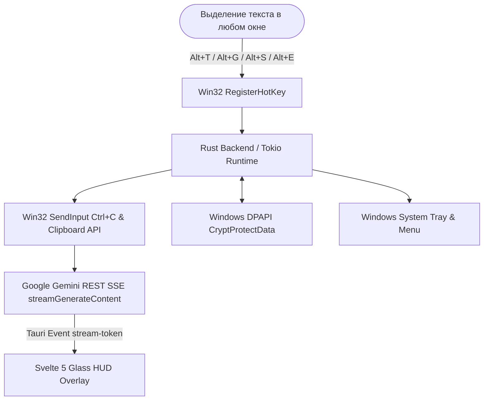

<div align="center">

# 🌐 PolyShift (Полишифт)

**Молниеносный нативный ИИ-помощник для Windows 10/11.**  
*Мгновенный перевод, исправление стиля, суммаризация и объяснение любого текста по горячим клавишам.*

[](https://github.com/kobaltgit/polyshift/releases)
[](https://github.com/kobaltgit/polyshift)
[](https://www.rust-lang.org/)
[](https://tauri.app/)
[](https://svelte.dev/)
[](LICENSE)

[**📥 Скачать установщик (.exe)**](https://github.com/kobaltgit/polyshift/releases) • [**📦 Портабельная версия (.zip)**](https://github.com/kobaltgit/polyshift/releases) • [**📖 Вики / Документация**](wiki/Home.md)

</div>

---

## 📖 Подробная инструкция для чайников (от А до Я)

Если вы никогда раньше не пользовались API-ключами или подобными программами — **не переживайте!** Настройка занимает ровно **2 минуты** и делается всего один раз.

---

### Шаг 1. Скачайте и запустите PolyShift

Перейдите в раздел **[Релизы](https://github.com/kobaltgit/polyshift/releases)** и выберите удобный для вас вариант:

* **Вариант А: Установщик (`PolyShift_2.0.0_x64-setup.exe`) — рекомендуется.**  
  Дважды кликните по файлу, нажмите «Далее» и «Установить». Программа установится на ваш ПК, добавит ярлык и будет готова к автозапуску.
* **Вариант Б: Портабельная версия (`PolyShift-v2.0.0-Portable-x64.zip`).**  
  Скачайте архив, распакуйте его в любую папку (например, на рабочий стол или диск D) и запустите `PolyShift.exe`. Программа не оставляет мусора в системе.

> 💡 **Что произойдет после запуска?**  
> Большое окно не откроется — так и должно быть! PolyShift — это тихий фоновый помощник. В правом нижнем углу экрана (возле часов Windows, в системном трее) появится синяя иконка PolyShift.

---

### Шаг 2. Получите бесплатный ключ Google Gemini за 1 минуту

PolyShift использует мощную языковую модель Google Gemini напрямую. Google предоставляет **бесплатный доступ** для личного использования (до 15 запросов в минуту — этого с головой хватает для сотен переводов в день).

1. Перейдите на официальный сайт: 👉 **[aistudio.google.com/app/apikey](https://aistudio.google.com/app/apikey)**.
2. Войдите под своим обычным Google-аккаунтом (Gmail).
3. Нажмите синюю кнопку **«Create API key»** (Создать API-ключ).
4. Выберите любой существующий проект или нажмите *«Create key in new project»*.
5. На экране появится ваш персональный ключ — длинная строка, начинающаяся с `AIzaSy...`.
6. Нажмите кнопку **«Copy»** (Скопировать).

*(Никаких банковских карт и оплат не требуется, это официальный бесплатный тариф Google).*

---

### Шаг 3. Вставьте ключ в PolyShift

1. В правом нижнем углу экрана (около часов Windows) найдите иконку **PolyShift** (если её не видно, нажмите на маленькую стрелочку `^`, чтобы открыть скрытые значки трея).
2. Нажмите по иконке **правой кнопкой мыши** и выберите **«Настройки»**.
3. В открывшемся окне настроек:
   * Вставьте скопированный ключ в поле **«Google Gemini API Ключ»**.
   * Нажмите кнопку **«Проверить»**. Программа сделает тестовый запрос и напишет зелёным: `Ключ активен! Задержка ответа: ~140 мс`.
   * В поле **«Основной язык перевода»** выберите ваш язык (по умолчанию уже стоит **Русский**).
   * Убедитесь, что включен тумблер **«Автокопирование в буфер обмена»** (чтобы перевод сразу копировался).
4. Нажмите синюю кнопку **«Сохранить настройки»** внизу окна.

> 🔒 **О безопасности вашего ключа:**  
> PolyShift шифрует ваш ключ встроенным аппаратным модулем Windows DPAPI (`CryptProtectData`). Ключ привязывается к вашей локальной учетной записи Windows — его невозможно похитить, даже скопировав файлы программы на другой компьютер.

---

### Шаг 4. Как пользоваться каждый день (Живые примеры)

Теперь самое приятное — забудьте про открытие сайтов онлайн-переводчиков и копирование туда-сюда. Выделяйте текст прямо там, где вы его читаете!

#### 🔹 Пример 1: Быстрый перевод иностранного текста (`Alt + T`)

1. Читаете англоязычный сайт, документацию, PDF-книгу или пост в Discord/Telegram.
2. Выделите мышкой любое непонятное предложение или абзац.
3. Нажмите на клавиатуре **Alt + T** (зажмите клавишу `Alt` и, не отпуская, нажмите букву `T` / русскую `Е`).
4. **Магия:** Прямо возле вашего курсора мыши появится аккуратное полупрозрачное окно, в котором в реальном времени побегут строчки перевода на русский язык!
   > 💡 **Перемещение окна:** Окно перевода можно свободно перемещать по экрану. Для этого зажмите левой кнопкой мыши **область заголовка окна** (слева, где расположено название режима и бейдж) и перетащите в удобное место (справа от заголовка находятся кнопки управления, поэтому перемещение выполняется именно за сам заголовок).
5. Перевод **уже скопирован в буфер обмена** — если нужно отправить его кому-то, просто нажмите `Ctrl + V` в чате!
6. Чтобы закрыть окно — нажмите клавишу **Esc** или кликните крестик.

#### 🔹 Пример 2: Написание письма или поста на чистом английском (`Alt + G`)

1. Напишите текст на английском в любом редакторе или поле ввода. Сомневаетесь в артиклях или временах?
2. Выделите свой текст и нажмите **Alt + G** (Grammar).
3. PolyShift исправит все грамматические и пунктуационные опечатки и выдаст идеальный текст на профессиональном английском без изменения исходного смысла.
4. Нажмите `Ctrl + V` — исправленный вариант вставится на место старого!

#### 🔹 Пример 3: Быстрая выжимка огромной статьи (`Alt + S`)

1. Перед вами гигантская статья, лонгрид или длинный отчет на 10 страниц.
2. Выделите весь объемный блок текста и нажмите **Alt + S** (Summarize).
3. PolyShift за пару секунд прочитает текст и выведет **2–4 четких тезиса на русском языке** с самой сутью статьи.

#### 🔹 Пример 4: Объяснение сложных терминов и ошибок кода (`Alt + E`)

1. Вы встретили в тексте непонятный научный термин, экономическое понятие или непонятную ошибку в консоли программирования.
2. Выделите термин или текст ошибки и нажмите **Alt + E** (Explain).
3. Появится понятное объяснение «человеческим языком»: что это значит, почему возникла ошибка и как её исправить.

---

## ⌨️ Шпаргалка по горячим клавишам

| Сочетание | Что делает | Для чего подходит |
| :---: | :--- | :--- |
| **`Alt + T`** | **Умный перевод** | Чтение зарубежных сайтов, документации, книг, переписки |
| **`Alt + G`** | **Грамматика и стиль** | Проверка своих писем, постов, резюме и сообщений |
| **`Alt + S`** | **Суммаризация (Выжимка)** | Чтение длинных новостей, условий соглашений, научных статей |
| **`Alt + E`** | **Анализ и объяснение** | Разбор терминов, незнакомых слов, кода и ошибок |
| **Зажатие ЛКМ за заголовок** | **Перемещение окна** | Зажмите заголовок окна слева от кнопок и перетащите в любое место экрана |
| **`Esc`** | **Скрыть окно** | Быстро закрыть оверлей, когда прочитали ответ |
| **`Ctrl + C`** | **Скопировать** | Копирование текста из окна оверлея вручную |

---

## ❓ Часто задаваемые вопросы (FAQ)

<details>
<summary><strong>1. Нажимаю Alt + T, но окно не появляется. Что делать?</strong></summary>

* Убедитесь, что PolyShift запущен (в правом нижнем углу возле часов должна быть синяя иконка).
* Убедитесь, что текст действительно выделен перед нажатием клавиш.
* В некоторых программах, запущенных от имени Администратора (например, PowerShell от админа), Windows запрещает перехват клавиш обычным программам. Запустите PolyShift от имени Администратора, если работаете в админских утилитах.

</details>

<details>
<summary><strong>2. В окне появляется сообщение: «Неверный API-ключ Gemini».</strong></summary>

* Откройте «Настройки» в трее PolyShift.
* Проверьте, не скопировался ли лишний пробел в начале или конце ключа.
* Нажмите кнопку «Проверить» рядом с полем ключа — она покажет точную причину ответа Google API.

</details>

<details>
<summary><strong>3. Это действительно бесплатно?</strong></summary>

* Да! Сам PolyShift — это открытая бесплатная программа без подписок и рекламы.
* Google Gemini API предоставляет щедрый бесплатный лимит для персонального использования (Free Tier), за который не нужно платить и не требуется привязывать банковскую карту.

</details>

<details>
<summary><strong>4. Видит ли кто-то мои тексты?</strong></summary>

* **Нет.** В отличие от большинства расширений и программ, у PolyShift **нет своих промежуточных серверов**. Программа связывается с сервером Google напрямую с вашего компьютера по шифрованному TLS-соединению. Никакие логи текста нигде не сохраняются.

</details>

<details>
<summary><strong>5. Сколько оперативной памяти потребляет программа?</strong></summary>

* Всего около **12–18 МБ RAM** в фоновом режиме. Для сравнения: Electron-приложения обычно занимают от 250 до 600 МБ.

</details>

---

## 🛠️ Сборка из исходников (для разработчиков)

```bash
# 1. Клонировать репозиторий
git clone https://github.com/kobaltgit/polyshift.git
cd polyshift

# 2. Установить зависимости UI
npm install

# 3. Запуск в режиме разработки с Hot-Reload
npm run tauri dev

# 4. Проверка типов
npm run check
cd src-tauri && cargo check && cd ..

# 5. Сборка дистрибутива (NSIS Installer + Portable EXE)
npm run tauri build
```

---

## 🏛️ Архитектура



---

## 📄 Лицензия

Распространяется под свободной лицензией **MIT License**. Подробности в файле [LICENSE](LICENSE).
