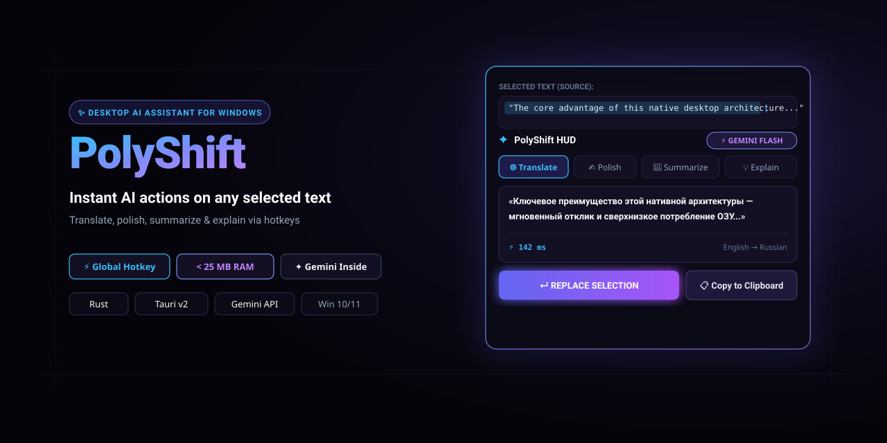

<p align="center">
  
</p>

<p align="center">
  
  <h1 align="center">PolyShift</h1>
  <strong>Молниеносный нативный ИИ-помощник, переводчик и OCR-распознаватель у курсора для Windows 10 & 11 на Rust и Tauri v2.</strong><br/>
  <em>Blazing-fast native AI assistant, cursor HUD translator & screenshot OCR for Windows 10 & 11 built with Rust & Tauri v2.</em>
</p>

<p align="center">
  <a href="https://github.com/kobaltgit/polyshift/releases/latest"></a>
  <a href="https://kobaltgit.github.io/polyshift/"></a>
  
  
  
  
  
  <a href="LICENSE"></a>
</p>

<p align="center">
  <a href="#-о-проекте">🇷🇺 Русский</a> • <a href="#-about-the-project">🇬🇧 English</a> • <a href="#-экосистема-kobalt-tools">🌐 Экосистема</a>
</p>

---

## 🇷🇺 О проекте

**PolyShift** — сверхлегковесный нативный ИИ-помощник для Windows 10 & 11, входящий в экосистему системных инструментов **Kobalt Tools** ([StashIt](https://github.com/kobaltgit/StashIt), [MiniBin](https://github.com/kobaltgit/minibin), [Undoit](https://github.com/kobaltgit/undoit), [PeekIt](https://github.com/kobaltgit/peekit)).

Позволяет мгновенно переводить, редактировать стиль, делать краткую выжимку или объяснять любой выделенный текст, а также **распознавать скриншоты** прямо поверх активного окна без переключения в браузер. Ответы транслируются потоком в реальном времени через официальный API Google Gemini в полупрозрачном стеклянном HUD-оверлее.

Потребляет **всего 12–18 МБ RAM** в фоновом режиме благодаря нативному ядру на **Rust** и реактивному интерфейсу на **Svelte 5** под движком **Tauri v2**.

### ⚡ Сравнение с аналогами

| Параметр | PolyShift v2.1 | Electron-помощники | Браузерные переводчики |
| :--- | :--- | :--- | :--- |
| **Стек технологий** | **Rust + Tauri v2 + Svelte 5** | Node.js + Chromium + Electron | Вкладка Chrome/Edge |
| **ОЗУ в фоне** | **12–18 МБ** | 250–600 МБ | 150–300 МБ на вкладку |
| **Холодный запуск** | **~50 мс** | 1.5–3.0 сек | Зависит от браузера |
| **Размер дистрибутива** | **~3.2 МБ (EXE)** | > 120 МБ | — |
| **Распознавание скриншотов** | **Встроено (мультимодальный Gemini)** | Редко / сторонние плагины | Требует загрузки файлов |
| **Приватность API** | **Прямой TLS к Google (без прокси)** | Часто через сервера авторов | Серверы переводчика |
| **Шифрование ключей** | **Аппаратный Windows DPAPI** | Обычный текст / JSON | Cookie браузера |

### 🎯 Ключевые возможности

- 📷 **Распознавание и перевод скриншотов (Zero-learning UX):**
  - Сделайте снимок области экрана через `Win + Shift + S` (или `PrtScn`).
  - Нажмите привычный хоткей `Alt + T` (перевод), `Alt + E` (объяснение), `Alt + S` (суммаризация) или `Alt + G` (полировка).
  - PolyShift автоматически подхватит изображение из буфера обмена, покажет превью фрагмента в HUD и запустит потоковый мультимодальный анализ. Идеально для невыделяемого текста: PDF, видео, картинок, кода на удалённых рабочих столах (RDP) и интерфейсов.
- 🌐 **Мгновенный перевод выделенного текста (`Alt + T`):** Перевод выделенного текста на родной язык с автокопированием или быстрой заменой.
- ✍️ **Грамматика и полировка (`Alt + G`):** Исправление грамматики и стилистики на естественном профессиональном языке без потери смысла.
- 📑 **Суммаризация (`Alt + S`):** 2–4 ёмких тезиса из больших статей, лонгридов или юридических документов.
- 💡 **Объяснение терминов и ошибок (`Alt + E`):** Понятный разбор сложных терминов, стектрейсов и ошибок компилятора/консоли.
- 🔒 **Безопасность Windows DPAPI:** API-ключ шифруется аппаратно с помощью `CryptProtectData` текущей учётной записи Windows.
- 🪟 **Плавающий HUD-оверлей:** Перемещение окна мышью за заголовок, автоприлипание к границам экрана, закрытие по `Esc`, темная и светлая темы.

### 📥 Установка и варианты загрузки

Скачайте актуальную версию со [страницы последнего релиза](https://github.com/kobaltgit/polyshift/releases/latest):

- 📦 **Установщик EXE (`PolyShift_2.1.0_x64-setup.exe`):** Быстрая установка NSIS в пользовательский профиль (не требует прав администратора).
- 🛠️ **Корпоративный пакет MSI (`PolyShift_2.1.0_x64_en-US.msi`):** Для системных администраторов и централизованного развертывания через Active Directory (GPO), Microsoft Intune.
- 💼 **Портабельная версия ZIP (`PolyShift-v2.1.0-Portable-x64.zip`):** Автономный исполняемый файл `polyshift.exe`, запускается без установки из любой папки или с флешки.

### 🔑 Быстрый старт с Google Gemini API (1 минута)

1. Получите бесплатный ключ на **[aistudio.google.com/app/apikey](https://aistudio.google.com/app/apikey)** (официальный Free Tier Google: до 15 запросов в минуту, без банковских карт и оплат).
2. Откройте «Настройки» в трее PolyShift (правый клик по иконке у часов).
3. Вставьте ключ и нажмите **«Проверить»** -> **«Сохранить»**.

---

## 🇬🇧 About the Project

**PolyShift** is an ultra-lightweight, native Windows 10 & 11 AI assistant, HUD translator, and screenshot OCR tool, part of the **Kobalt Tools** desktop ecosystem ([StashIt](https://github.com/kobaltgit/StashIt), [MiniBin](https://github.com/kobaltgit/minibin), [Undoit](https://github.com/kobaltgit/undoit), [PeekIt](https://github.com/kobaltgit/peekit)).

It instantly translates, polishes grammar, summarizes, or explains highlighted text as well as **screenshots** directly over your active application without tab switching. Powered by Google Gemini API with live token streaming inside a sleek Fluent acrylic overlay.

Consumes only **12–18 MB RAM** in background idle mode, built entirely with **Rust 2021** and **Svelte 5** under **Tauri v2**.

### ⚡ Key Benchmarks

| Metric | PolyShift v2.1 | Electron AI Apps | Browser Translators |
| :--- | :--- | :--- | :--- |
| **Tech Stack** | **Rust + Tauri v2 + Svelte 5** | Node.js + Chromium + Electron | Chrome / Edge Tab |
| **Idle RAM** | **12–18 MB** | 250–600 MB | 150–300 MB per tab |
| **Cold Launch** | **~50 ms** | 1.5–3.0 sec | Browser dependent |
| **Installer Size** | **~3.2 MB (EXE)** | > 120 MB | — |
| **Screenshot OCR** | **Built-in (multimodal Gemini)** | Rare / third-party plugins | Requires manual file upload |
| **API Privacy** | **Direct client TLS to Google (zero proxy)** | Routed via author servers | Cloud servers |
| **Key Storage** | **Hardware Windows DPAPI** | Plain text / localStorage | Browser cookies |

### 🎯 Core Features

- 📷 **Zero-Learning Screenshot OCR & Translation:**
  - Take a snip using `Win + Shift + S` or `PrtScn`.
  - Press your familiar shortcut: `Alt + T` (translate), `Alt + E` (explain), `Alt + S` (summarize), or `Alt + G` (polish).
  - PolyShift automatically fetches the image from clipboard (`CF_DIB`), displays a thumbnail preview in the HUD, and streams Gemini Flash multimodal insights. Perfect for scanned PDFs, UI labels, videos, and remote desktop sessions.
- 🌐 **Instant Cursor Translation (`Alt + T`):** Translates selected text directly at your mouse cursor with optional auto-clipboard copy or quick replace.
- ✍️ **Grammar & Tone Polish (`Alt + G`):** Corrects grammar and refines text into natural, professional English without altering core meaning.
- 📑 **Instant Summary (`Alt + S`):** Distills long articles, PDFs, or documentation into 2–4 concise bullet points.
- 💡 **Explain & Debug (`Alt + E`):** Human-readable explanations of complex terms, stack traces, and compiler error logs.
- 🔒 **Hardware DPAPI Security:** API keys are encrypted via `CryptProtectData` tied exclusively to your Windows user account.
- 🪟 **Draggable Fluent HUD:** Acrylic translucent overlay, draggable by title, edge snapping, dismissed with `Esc`.

### 📥 Installation & Downloads

Download the latest release from [GitHub Releases](https://github.com/kobaltgit/polyshift/releases/latest):

- 📦 **EXE Installer (`PolyShift_2.1.0_x64-setup.exe`):** Fast NSIS user-mode setup (no administrative privileges needed).
- 🛠️ **MSI Package (`PolyShift_2.1.0_x64_en-US.msi`):** Enterprise-grade Windows Installer package for GPO / Microsoft Intune deployment.
- 💼 **Portable ZIP (`PolyShift-v2.1.0-Portable-x64.zip`):** Standalone executable `polyshift.exe`, extract and run anywhere.

---

## 🛠️ Сборка и разработка / Development

```bash
# 1. Установка зависимостей фронтенда
npm install

# 2. Запуск в режиме разработки (Hot Reload)
npm run tauri dev

# 3. Сборка всех релизных пакетов (EXE, MSI)
npm run tauri build
```

---

## 🌐 Экосистема Kobalt Tools

| Проект | Описание | Стек | Ссылки |
| :--- | :--- | :--- | :--- |
| 📥 **StashIt** | Плавающий карман Drag-and-Drop (Dropover / Yoink для Windows) | Rust + Tauri v2 + Svelte 5 | [Repo](https://github.com/kobaltgit/StashIt) • [Web](https://kobaltgit.github.io/StashIt/) |
| 🗑️ **MiniBin** | Умная корзина в системном трее с Flyout-интерфейсом | Rust + Tauri v2 + Svelte 5 | [Repo](https://github.com/kobaltgit/minibin) • [Web](https://kobaltgit.github.io/minibin/) |
| ⏱️ **Undoit** | Локальная машина времени и версионирование файлов (Ctrl+Z) | Rust + Tauri v2 + Svelte 5 | [Repo](https://github.com/kobaltgit/undoit) • [Web](https://kobaltgit.github.io/Undoit/) |
| 🌐 **PolyShift** | HUD-помощник и контекстный перевод у курсора с Gemini AI | Rust + Tauri v2 + Svelte 5 | [Repo](https://github.com/kobaltgit/polyshift) • [Web](https://kobaltgit.github.io/polyshift/) |
| 👁️ **PeekIt** | Мгновенный предпросмотр файлов по клавише Space | Rust + Tauri v2 + Svelte 5 | [Repo](https://github.com/kobaltgit/peekit) • [Web](https://kobaltgit.github.io/PeekIt/) |
| 🧩 **PeekIt Plugins** | Официальный реестр и SDK веб-плагинов для PeekIt | TypeScript + Web SDK | [Repo](https://github.com/kobaltgit/peekit-plugins) • [Web](https://kobaltgit.github.io/peekit-plugins/) |
| 🎨 **kobalt_ui** | Общая библиотека UI компонентов (шапка, футер, релизы) | Flutter Web (Dart) | [Repo](https://github.com/kobaltgit/kobalt_ui) |

---

## 📄 Лицензия / License

Распространяется под лицензией **MIT**. Подробнее в файле [LICENSE](LICENSE).  
Copyright (c) 2025–2026 Kobalt.
