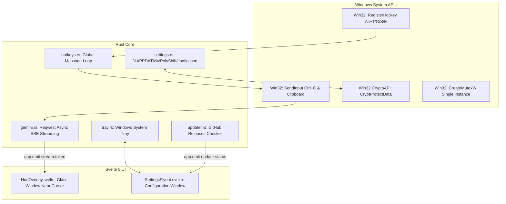

# 🏗️ Архитектура и стек технологий

PolyShift спроектирован по принципу максимальной производительности, минимального веса и нулевого влияния на ресурсы компьютера.

---

## 💻 Стек технологий

* **Ядро (Backend)**: Rust (2021 edition) + Tauri v2
* **Фронтенд (UI)**: Svelte 5 + SvelteKit + TypeScript + Vite
* **Стилизация**: Custom Slate Dark CSS Design System (Glassmorphism, Windows Fluent Design вдохновение)
* **AI Провайдер**: Google Gemini REST API (v1beta) с прямым SSE-стримингом (`streamGenerateContent?alt=sse`)
* **Сборка инсталлятора**: NSIS (Nullsoft Scriptable Install System) через Tauri CLI

---

## 📐 Архитектурная схема

---

## ⚡ Оптимизации производительности

1. **Единичный экземпляр (Single Instance Mutex)**: При повторном клике на иконку не запускается дубликат процесса — системный мьютекс `Local\PolyShift_SingleInstance_Mutex` отсекает повторные запуски.
2. **Нулевой простой**: Окно HUD при скрытии не уничтожается, а прячется через Win32 API, благодаря чему повторное открытие по горячей клавише происходит за **< 5 миллисекунд**.
3. **Прямой стриминг токенов**: Парсинг JSON-чанков Gemini SSE происходит на лету в фоновом Tokio-потоке с мгновенной передачей в SvelteKit через внутреннюю шину событий Tauri.
